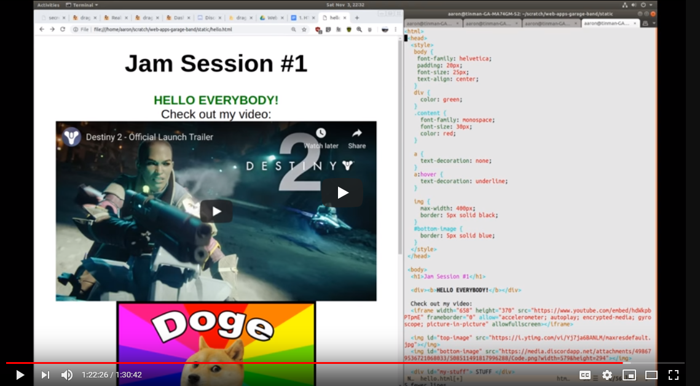

# Jam session #1
"Web 1.0" 

In this session we go over how to make static web pages. I.e., what the web looked like in the 90s. 
We're going to take a trip down memory lane, starting with the early days of the internet. 
This will give you the basics and a good foundation. 
That way, you'll better understand and appreciate present-day tech when we get to it in a few sessions.

### Index

- 11.15 Start with local file HTML, open in browser 
- 13.44 Introduce HTML syntax
- 20:30 Make new page, link to other pages
- 30:50 `
`
- 37:34 separating content and style
- 40:10 CSS in `<head>`
- 42:31 changing body font
- 51:40 h1 h2 h3
- 56:16 # vs . (id vs class)
- 1:08:00 images
- 1:18:00 embed youtube video

Once you feel good about your local changes, it's time to put it up on the Internet. Then your website will be LIVE and visible by anyone from anywhere in the world!

### How to host your page live on the Internet (for free)
1. Make a Github account @ [github.com](https://github.com/) and sign in

2. Click to make a new repository:

   
3. Give the repository the special name `username.github.io` (where “username” is your GitHub user name):

  
  
4. That's it! Now any page you put in this repository will appear online. 
    For example, if you put your `hello.html` page in your `your_username.github.io` repository, it will appear online @ `http://your_username.github.io/hello.html` 
    
For more information, see [https://pages.github.com/](https://pages.github.com/) or [https://guides.github.com/features/pages/](https://guides.github.com/features/pages/)
   
