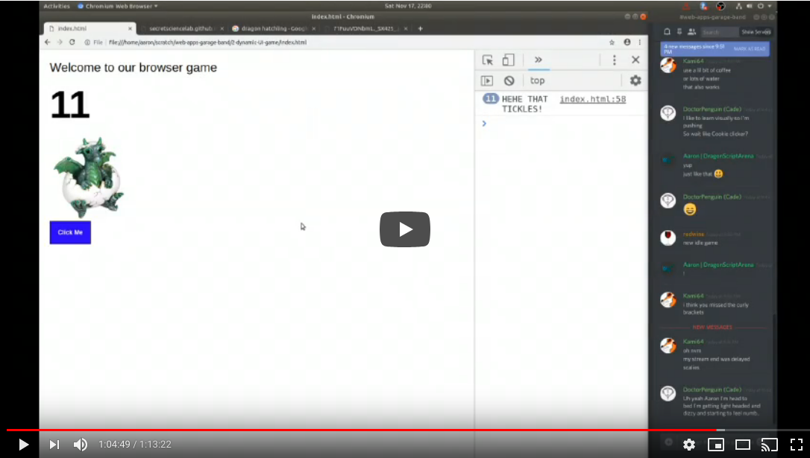

# Jam session #2

"Web 1.5" 

In this session we go over how to make dynamic web pages. We'll look at how to make a Javascript Web UI and use our new skills to make a simple browser game.

[](https://www.youtube.com/watch?v=IpXA53_YUSk)

## Index

- 7:27 include jQuery
- 11:55 add `<script>` section
- 12:31 `alert()`
- 16:45 F12 console
- 17:20 `console.log()`
- 20:23 `#` and `.` selectors
- 23:09 `.html()`
- 25:36 `.css()`
- 29:00 event handlers
- 33:17 `.click()`
- 49:13 simple clicker browser game


## Code used in Jam Session #2

```
<html>
  <head>
    <style>
      body {
        font-family: arial;
        padding: 20px;
      }

      #header {
        font-size: xx-large;
      }

      #clickme {
        border: 1px solid black;
        background-color: blue;
        color: white;
        font-weight: bold;
        padding: 20px;
        display: inline-block;
        cursor: pointer;
      }

      #clicks {
        font-size: 100px;
        font-weight: bold;
        margin-top: 20px;
        margin-bottom: 20px;
      }

      .card {
        max-width: 200px;
        display: none;
      }
    </style>
    <script src="https://ajax.googleapis.com/ajax/libs/jquery/3.3.1/jquery.min.js"></script>
  </head>

  <body>
    <div id=header>Welcome to our browser game</div> 

    <div id=clicks>0</div>

    </img>
    </img>
    </img>

    <div class="wrapper">
      <div id="clickme">Click Me</div>
    </div>

    <script>
      $("#egg").show();

      var clickCounter = 0;

      // add click handler for button
      $("#clickme").click(
        function() {
          console.log( "HEHE THAT TICKLES!" );
          clickCounter += 1;          

          $("#clicks").html(clickCounter);

          // change picture after some clicks
          if (clickCounter > 10 && clickCounter < 20)
          {
            $(".card").hide();
            $("#hatchling").show();
          }
          else if (clickCounter > 20)
          {
            $(".card").hide();
            $("#adult").show();
          }
              
        }
      );

      
    </script>
  </body>
</html>
```
